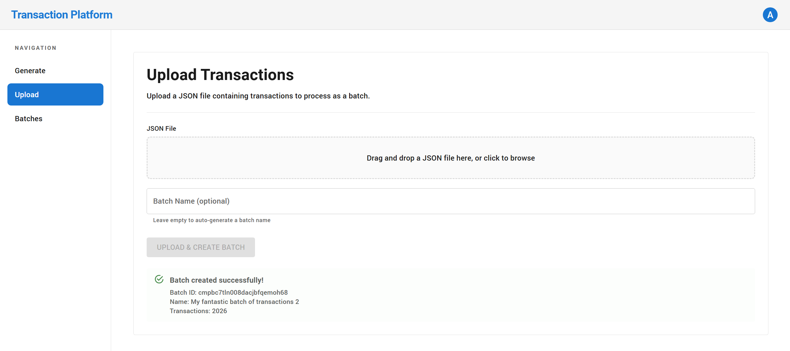
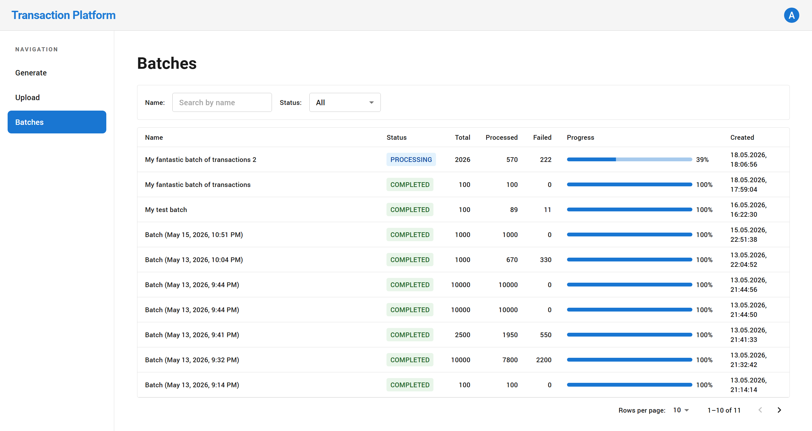
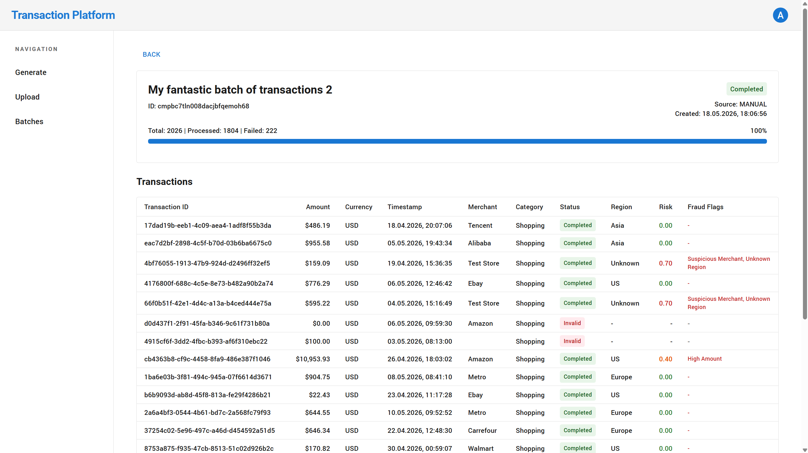
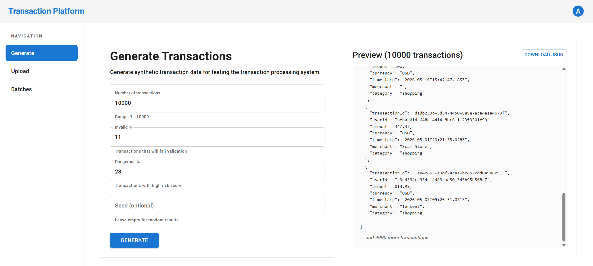

# Transaction Platform

---

## Key idea

This is not just a "transaction service".

It is a fault-tolerant processing system that guarantees every piece of data
will pass through a defined sequence of steps — without being lost,
even under failures.

---

## Core principles

The system ensures that:

- every transaction is eventually processed
- no step is lost due to crashes or partial failures
- processing is fully asynchronous and horizontally scalable
- each step is explicitly controlled via a state machine (`status` + `currentStep`)
- consistency between database and queue is guaranteed via the outbox pattern

---

## Screenshots

### Upload transactions


### Monitor processing


### View batch details


### Generate test data


---

## What makes it reliable

Even if:

- workers crash mid-processing
- queue delivery fails
- invalid or partial data is received
- the system is under high load

→ transactions are not lost and will be recovered and continued automatically

---

## Technology stack

| Layer | Technology |
|---|---|
| **Backend** | NestJS + TypeScript, class-validator, class-transformer, Prisma |
| **Frontend** | Next.js + TypeScript, MUI, tailwindcss, next-auth (Auth.js), Prisma |
| **Data & Storage** | PostgreSQL (Prisma), Redis (cache + queue) |
| **Messaging** | BullMQ (Redis-based queue) |
| **Infra** | docker-compose |

**Infrastructure concepts:**
- microservices architecture
- event-driven processing
- background workers
- distributed job processing

**Observability** *(optional)*: OpenTelemetry, logging + metrics + tracing

---

## Domain

### Transaction

Each transaction is an atomic financial event.

**Raw input:**
```json
{
  "transactionId": "uuid",
  "userId": "uuid",
  "amount": 120.50,
  "currency": "USD",
  "timestamp": "ISO-8601",
  "merchant": "string",
  "category": "string"
}
```

**Enriched entity** (as it moves through the pipeline):
```json
{
  "transactionId": "...",
  "userId": "...",
  "amount": 120.50,
  "currency": "USD",
  "timestamp": "...",

  "merchant": "Amazon",
  "category": "shopping",

  "region": "US",

  "riskScore": 0.82,
  "fraudFlags": ["HIGH_AMOUNT", "VELOCITY_ANOMALY"],

  "status": "PENDING | PROCESSING | COMPLETED | FAILED | FAILED_FINAL",
  "currentStep": "VALIDATE | ENRICH | ANALYZE | null",

  "batchId": "uuid",
  "processingStartedAt": "timestamp | null",

  "createdAt": "timestamp",
  "updatedAt": "timestamp"
}
```

### Batch

| Status | Meaning |
|---|---|
| `PROCESSING` | there are unfinished transactions |
| `COMPLETED` | all finished (`processed + failed = total`) |
| `FAILED` | optional state for "everything is bad" |

```json
{
  "id": "uuid",
  "name": "string",

  "status": "PROCESSING | COMPLETED | FAILED",

  "total": 1000,
  "processed": 800,
  "failed": 200,

  "createdAt": "timestamp",
  "updatedAt": "timestamp"
}
```

**How batch is updated** (only in worker):
- transaction `COMPLETED` → `processed++`
- transaction `FAILED` → `failed++`

**When batch is considered completed:**
```
processed + failed == total → status = COMPLETED
```

---

## How it works

The system is a web application with a UI where a user can generate or upload a JSON with transactions, optionally specifying a batch name (if not specified, it is generated automatically).

Generation occurs directly in the UI — the user sets parameters (number of transactions, proportion of invalid data, patterns of suspicious operations, seed for reproducibility), after which a JSON for upload is formed. Note that generation is used only for demonstration and testing, and is not part of the real production flow.

### Flow

1. User submits data → frontend calls the API (Next.js acts as BFF/API Gateway using Auth.js)
2. API creates a batch record (`status = PROCESSING`, expected count, source)
3. API accepts an array of transactions. `transactionId` is required — it's the unique idempotency key. If not provided, an error is returned.
4. Each transaction is saved as a separate record (`batchId`, initial fields, `status = PENDING`, `currentStep = VALIDATE`). A uniqueness constraint on `transactionId` ensures idempotency.
5. Within the same database transaction, an outbox event is created for each transaction (e.g., `VALIDATE`) — guaranteeing atomic persistence of both data and processing intent
6. API immediately returns (`batchId`) without waiting for execution
7. A background worker reads unprocessed outbox events, publishes jobs to the queue (Redis/BullMQ), and marks events as processed
8. Workers process transactions via state machine:
   - **VALIDATE** → checks required fields and basic rules
     - Fail → `status = FAILED` or `FAILED_FINAL`, `currentStep = null`
     - Success → `currentStep = ENRICH`, `status = PENDING`, new outbox event
   - **ENRICH** → adds computed data (e.g., `region`)
     - Success → `currentStep = ANALYZE`, `status = PENDING`, new outbox event
   - **ANALYZE** → calculates `riskScore` and forms `fraudFlags`
     - Success → `status = COMPLETED`, `currentStep = null`
9. BullMQ retries with backoff on errors; exceeding retry limit → `FAILED_FINAL`
10. A recovery worker periodically re-enqueues stuck transactions (`currentStep != null`, outdated `updatedAt`)

As processing progresses, the aggregated batch state (`processed/failed/total`) is updated — the UI shows real-time progress, and users can open a batch to see transaction details, statuses, steps, and analysis results.

---

## Project structure

```
transaction-platform
├── transaction-hub      # Next.js app (MUI, tailwindcss, next-auth, Prisma)
└── transaction-service  # NestJS backend (Prisma, BullMQ workers)
```

---

## Full transaction processing flow

```
┌─────────────────────────────────────────────────────────────────────┐
│                           INGESTION                                  │
│                                                                      │
│  User submits batch → API creates:                                  │
│    • batch record (PROCESSING)                                      │
│    • transaction records (PENDING, currentStep=VALIDATE)            │
│    • outbox events (VALIDATE)                                       │
│                                                                      │
│  All in one atomic database transaction                             │
└────────────────────────────┬────────────────────────────────────────┘
                             │
                             ▼
┌─────────────────────────────────────────────────────────────────────┐
│                         OUTBOX DELIVERY                              │
│                                                                      │
│  Background worker reads unprocessed outbox events                   │
│  → converts to queue jobs                                           │
│  → marks events as processed after delivery                         │
└────────────────────────────┬────────────────────────────────────────┘
                             │
                             ▼
┌─────────────────────────────────────────────────────────────────────┐
│                      STEP EXECUTION (state machine)                 │
│                                                                      │
│  Each transaction moves independently through:                      │
│                                                                      │
│  ┌──────────┐    ┌──────────┐    ┌──────────┐                      │
│  │ VALIDATE │───▶│  ENRICH  │───▶│ ANALYZE  │                      │
│  └──────────┘    └──────────┘    └──────────┘                      │
│       │               │               │                            │
│       ▼               ▼               ▼                            │
│   check fields    add computed    risk analysis                    │
│   basic rules     data (region)  fraud flags                       │
│                                                                      │
│  Worker claims transaction (status=PROCESSING, processingStartedAt) │
│                                                                      │
│  On success: update state + create next outbox event                 │
│  On failure: retry with backoff → FAILED_FINAL if limit exceeded    │
└────────────────────────────┬────────────────────────────────────────┘
                             │
                             ▼
┌─────────────────────────────────────────────────────────────────────┐
│                          COMPLETION                                  │
│                                                                      │
│  After ANALYZE:                                                      │
│    • transaction → COMPLETED                                         │
│    • currentStep → null                                              │
│                                                                      │
│  Batch state updated: processed++ or failed++                      │
└─────────────────────────────────────────────────────────────────────┘
```

### Recovery guarantees

- If a job is not delivered → it remains in outbox and will be retried
- If a worker crashes → transaction remains in a recoverable state
- A recovery worker periodically re-enqueues stuck transactions

### Observability

- Batch progress is aggregated (`processed / failed / total`)
- Each transaction exposes:
  - current status
  - current step
  - processing results (risk score, fraud flags)